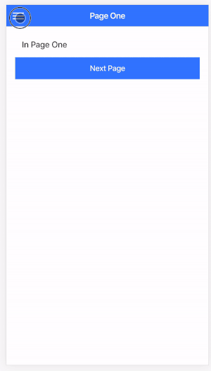

This project was bootstrapped with [Create React App](https://github.com/facebook/create-react-app) and uses the beta [Ionic Framework React Components](https://github.com/ionic-team/ionic)

- create react app
- Ionic SideMenu
- React Router

#### See other Ionic React Samples
- https://github.com/aaronksaunders/my-react-ionic-app
